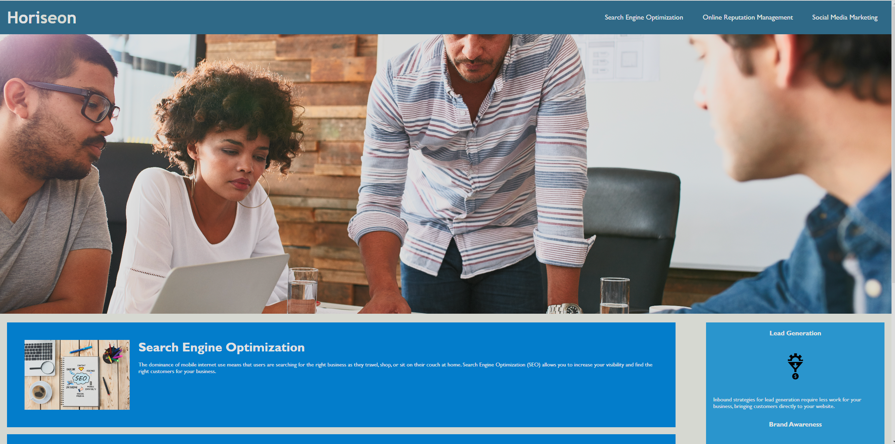

# Horiseon-SSS.inc

# Description
We performed an on-the-job ticket, where we were given a set amount of acceptance criteria that we had to complete before submitting. We also had to work through submitting a quality README, that gave a quick description, a Mock image, and a live link to our webpage. 

# Mock-Up

# Deployed Application

[live link](https://j3rryb0y13.github.io/Horiseon-SSS.inc/) 
